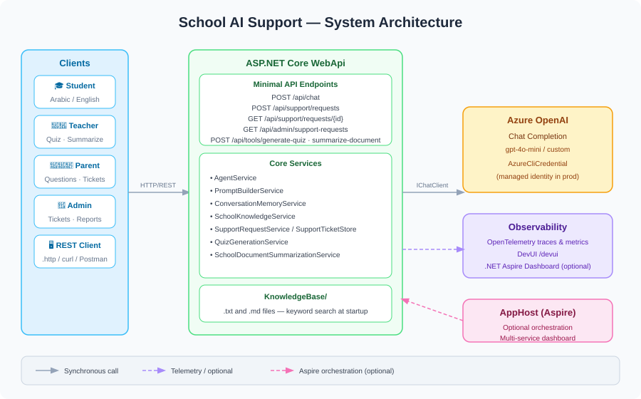
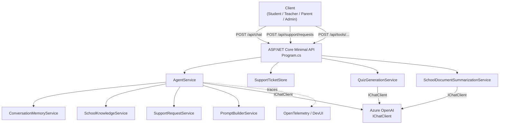
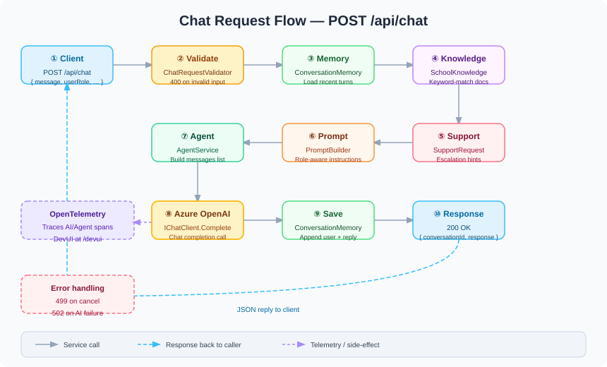
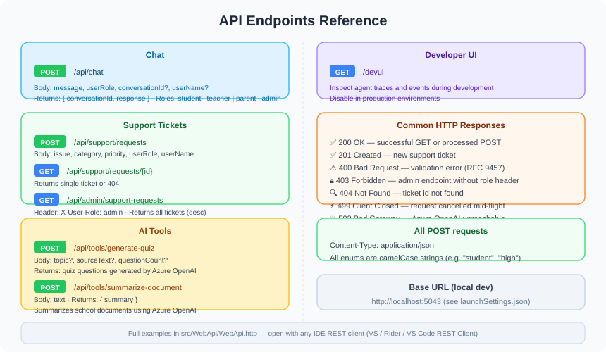

# 🏫 School AI Support Agent

[](https://dotnet.microsoft.com/download)
[](https://learn.microsoft.com/aspnet/core/fundamentals/minimal-apis)
[](https://learn.microsoft.com/azure/ai-services/openai/)
[](LICENSE)

A **.NET 10** reference implementation of a school-facing AI assistant: role-aware bilingual chat (Arabic / English), lightweight document retrieval, support ticketing, and AI-powered tools — built with **ASP.NET Core Minimal APIs**, **Microsoft.Extensions.AI**, **Azure OpenAI**, optional **.NET Aspire** orchestration, and **DevUI** for debugging agent flows.

> **Note:** This repository is a solid starting point for a real deployment. Tighten security, persistence, and identity before going to production (see [Security notes](#security-notes)).

---

## Table of Contents

- [What it does](#what-it-does)
- [Features](#features)
- [Architecture](#architecture)
- [Chat request flow](#chat-request-flow)
- [Prerequisites](#prerequisites)
- [Setup](#setup)
- [Azure OpenAI configuration](#azure-openai-configuration)
- [Adding school documents](#adding-school-documents)
- [API reference](#api-reference)
- [Observability](#observability)
- [Diagrams](#diagrams)
- [Roadmap](#roadmap)
- [Security notes](#security-notes)
- [License](#license)

---

## What it does

The **School AI Support Agent** helps **students**, **teachers**, **parents**, and **admin** staff with common questions. It:

- Answers in **Arabic first**, switching to **English** when the user writes in English.
- Pulls **grounding context** from your own **`.txt` / `.md`** files under a `KnowledgeBase/` folder (keyword search — no vector embeddings required).
- Keeps **short in-memory conversation history** per `conversationId`.
- Offers **REST APIs** for **support tickets**, **quiz generation**, and **document summarization** using the same Azure OpenAI deployment.

---

## Features

| Area | Description |
|------|-------------|
| **Chat** | `POST /api/chat` — accepts `message`, `userRole`, optional `conversationId` / `userName`; validated input and structured JSON response. |
| **Prompts** | Centralized system prompt + per-role supplements via `PromptBuilderService`. |
| **Knowledge base** | `.txt` / `.md` files loaded at startup, chunked, and scored by keyword; matching excerpts are injected into the agent prompt automatically. |
| **Support tickets** | In-memory store; create and fetch by ID; admin list endpoint gated by a role header (see [Security notes](#security-notes)). |
| **AI Tools** | Quiz generation and school-text summarization powered by `IChatClient` and Azure OpenAI. |
| **Dev / ops** | **DevUI** at `/devui`; **OpenTelemetry** for AI/agent spans; **Aspire AppHost** for dashboard and multi-service orchestration. |

---

## Architecture

```
src/
├── AppHost/            # .NET Aspire orchestrator (optional)
├── ServiceDefaults/    # Shared HTTP resilience, service discovery, OpenTelemetry
└── WebApi/             # Minimal API -- agent, chat, knowledge base, tools
    ├── KnowledgeBase/  # School documents (.txt, .md) -- copied to build output
    ├── Models/         # Request / response records
    ├── Services/       # AgentService, PromptBuilder, KnowledgeService, ...
    └── Program.cs      # Endpoint definitions and DI registration
```

### System architecture diagram



### Service dependency graph



---

## Chat request flow



Step-by-step walkthrough of `POST /api/chat`:

| Step | Service | What happens |
|------|---------|-------------|
| 1 | `ChatRequestValidator` | Validates message length, `userRole`, and required fields. Returns `400` on failure. |
| 2 | `ConversationMemoryService` | Loads recent turns for the given `conversationId`. |
| 3 | `SchoolKnowledgeService` | Scores and returns top keyword-matched document chunks. |
| 4 | `SupportRequestService` | Appends escalation instructions if sensitive keywords are present. |
| 5 | `PromptBuilderService` | Builds role-specific system instructions (Arabic-first; student / teacher / parent / admin tone). |
| 6 | `AgentService` | Assembles the full message list and calls `IChatClient` → Azure OpenAI. |
| 7 | `ConversationMemoryService` | Appends the user message and assistant reply back to memory. |
| 8 | Endpoint | Returns `200 OK` with `{ conversationId, response }`. |

---

## Prerequisites

- [.NET SDK 10](https://dotnet.microsoft.com/download) — matches the `<TargetFramework>` in the project files
- An **Azure OpenAI** resource with a chat-capable model deployment
- [Azure CLI](https://learn.microsoft.com/cli/azure/install-azure-cli) logged in (`az login`) — used for `AzureCliCredential` in local development
- Optional: **.NET Aspire** workload (`dotnet workload install aspire`) for running the `AppHost` with a live dashboard

---

## Setup

### 1. Clone and restore

```bash
git clone https://github.com/AlyaariHazem/SchoolAISupport.git
cd SchoolAISupport
dotnet restore src/MinimalAgent.slnx
```

### 2. Configure environment variables

Set the Azure OpenAI variables before running (see [Azure OpenAI configuration](#azure-openai-configuration)). Options:

- Shell environment variables (examples below)
- .NET user-secrets (`dotnet user-secrets set ...` inside `src/WebApi`)
- A `.env` file (add to `.gitignore` — never commit)
- IDE launch profile (`Properties/launchSettings.json`)

### 3. Run the API

**Option A — Web API only**

```bash
cd src/WebApi
dotnet run
```

Default local URL: `http://localhost:5043` (see `Properties/launchSettings.json`).

**Option B — Aspire (dashboard + Web API)**

```bash
dotnet run --project src/AppHost/AppHost.csproj
```

The Aspire dashboard URL appears in the terminal. Open **DevUI** at `{webapi-base-url}/devui` to inspect agent traces and events.

---

## Azure OpenAI configuration

| Variable | Required | Description |
|----------|----------|-------------|
| `AZURE_OPENAI_ENDPOINT` | **Yes** | Resource endpoint, e.g. `https://your-resource.openai.azure.com/` |
| `AZURE_OPENAI_DEPLOYMENT_NAME` | No | Name of your chat model deployment. Defaults to `gpt-4o-mini` if unset. |

**PowerShell**

```powershell
$env:AZURE_OPENAI_ENDPOINT = "https://your-resource.openai.azure.com/"
$env:AZURE_OPENAI_DEPLOYMENT_NAME = "your-chat-deployment-name"
```

**Bash / zsh**

```bash
export AZURE_OPENAI_ENDPOINT="https://your-resource.openai.azure.com/"
export AZURE_OPENAI_DEPLOYMENT_NAME="your-chat-deployment-name"
```

The sample uses `AzureCliCredential` for local development. For production, replace with a **managed identity** or **workload identity** appropriate to your Azure host.

---

## Adding school documents

1. Create or edit files under `src/WebApi/KnowledgeBase/`.
2. Supported extensions: **`.txt`** and **`.md`** (any subfolder depth is allowed).
3. Files are automatically included in the build output (`WebApi.csproj` copies `KnowledgeBase/**`).
4. **Restart** the application after editing files — `SchoolKnowledgeStartupLoader` reads documents from disk on startup only.
5. Retrieval is **keyword-based** (no embeddings). Use clear headings and terms your users will actually type, including both Arabic and English variants where relevant.

Example files already in the repository:

| File | Contents |
|------|----------|
| `attendance_en.txt` | English attendance policy |
| `exams_schedule_ar.txt` | Arabic exam schedule |
| `fees_policy_ar.md` | Arabic fees policy |

---

## API reference



Base URL in all examples: `http://localhost:5043` — adjust for your environment.

All POST endpoints require `Content-Type: application/json`. Enum values use camelCase strings (e.g. `"student"`, `"high"`).

### Chat

```http
POST /api/chat
Content-Type: application/json

{
  "message": "متى موعد الاختبار؟",
  "userRole": "student",
  "conversationId": "abc123",
  "userName": "Ali"
}
```

**Response `200 OK`**

```json
{
  "conversationId": "abc123",
  "response": "موعد الاختبار هو ..."
}
```

Valid `userRole` values: `student` | `teacher` | `parent` | `admin`

### Create support ticket

```http
POST /api/support/requests
Content-Type: application/json

{
  "issue": "Cannot access LMS after password reset.",
  "category": "technical",
  "priority": "high",
  "userRole": "teacher",
  "userName": "Samira"
}
```

Valid `category` values: `academic` | `attendance` | `technical` | `admin` | `other`  
Valid `priority` values: `low` | `medium` | `high`

**Response `201 Created`** — returns the created ticket object including its generated `id`.

### Get ticket by ID

```http
GET /api/support/requests/{id}
```

Returns the ticket (`200 OK`) or `404 Not Found`.

### List all tickets (admin only)

```http
GET /api/admin/support-requests
X-User-Role: admin
```

Returns all tickets ordered by creation date descending. Returns `403 Forbidden` without the header.

### Generate quiz

```http
POST /api/tools/generate-quiz
Content-Type: application/json

{
  "topic": "Photosynthesis for grade 8",
  "questionCount": 3
}
```

Provide **`topic`** and/or **`sourceText`** — at least one is required.

### Summarize school document

```http
POST /api/tools/summarize-document
Content-Type: application/json

{
  "text": "Students must submit absence notes within 48 hours of returning to school..."
}
```

**Response `200 OK`**

```json
{ "summary": "..." }
```

> All HTTP request examples are also available in [`src/WebApi/WebApi.http`](src/WebApi/WebApi.http) for IDE REST clients (Visual Studio, JetBrains Rider, VS Code REST Client).

---

## Observability

| Feature | Details |
|---------|---------|
| **OpenTelemetry** | HTTP and runtime metrics; traces include wildcard sources for `Microsoft.Extensions.AI` and `Microsoft.Extensions.Agents` (configured in `ServiceDefaults/Extensions.cs`). |
| **Sensitive data** | The chat client enables sensitive payload capture for **local debugging only** — disable or redact before any shared environment. |
| **DevUI** | Inspect agent events and traces at `GET /devui` during development. Not intended for production exposure. |
| **Aspire Dashboard** | Run via `AppHost` for a live service map, structured logs, and distributed traces across all services. |

---

## Diagrams

| Diagram | Description |
|---------|-------------|
|  | Full system: clients, WebApi services, Azure OpenAI, and observability |
|  | Step-by-step chat request flow through all services |
|  | All REST endpoints with HTTP methods and response codes |

---

## Roadmap

Ideas for hardening and extending this sample:

- **Retrieval** — Embeddings + vector store (e.g. Azure AI Search); hybrid keyword + semantic search; inline citation links.
- **Persistence** — Database backend for tickets, conversation history, and audit logs.
- **Authentication** — OAuth 2.0 / Microsoft Entra ID; map claims to `userRole`; remove the header-only admin gate.
- **Streaming** — Server-Sent Events (SSE) or chunked transfer for `/api/chat` responses.
- **Safety** — Rate limiting, abuse controls, and Azure AI Content Safety integration.
- **Configuration** — Azure Key Vault for secrets; deployment-specific prompts; feature flags.
- **Tests** — Integration tests against Azure OpenAI or a mock `IChatClient`.

Contributions via issues and pull requests are welcome.

---

## Security notes

This project is optimized for **clarity and local development**, not production hardening. Address the following before any internet-facing deployment:

| Topic | Current behavior | Recommendation |
|-------|-----------------|----------------|
| **Admin API** | `X-User-Role: admin` HTTP header | Replace with real authentication and authorization (e.g. Entra ID roles). |
| **Support tickets** | Stored in-memory only | Persist to a database; restrict who can read PII fields. |
| **Credentials** | `AzureCliCredential` (local dev) | Use managed identity or workload identity on Azure. |
| **Telemetry** | May log full prompt / completion text | Disable `EnableSensitiveData` in production; control OTLP collector access. |
| **Chat input** | Length-limited but not scanned | Add content moderation, PII detection, and school-appropriate safeguards. |
| **Knowledge base** | File-based, trusted content only | Version-control and review all documents; treat as sensitive school data. |

> Never commit secrets. Use environment variables, Azure Key Vault, or your CI/CD secret store.

---

## License

This project is licensed under the **MIT License** — see the [`LICENSE`](LICENSE) file for the full text.

Copyright (c) 2026 Hazem Alyaari

---

## Acknowledgments

Built with **ASP.NET Core**, **Microsoft.Extensions.AI**, **Azure OpenAI**, and **Microsoft Agents** packages. Optional orchestration and dashboard via **.NET Aspire**.
